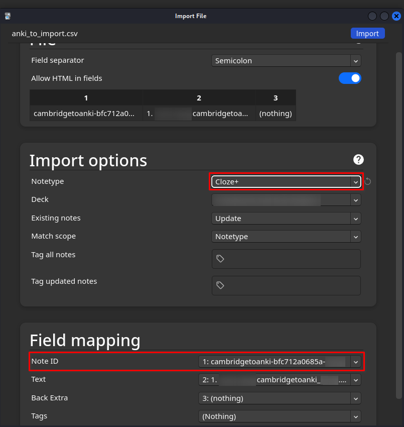

# Set up
## Project
WIP, but on linux, it should be:
1. `git clone https://github.com/leoCottret/cambridge-to-anki.git; cd cambridge-to-anki`
1. `pip3 install pipenv`
1. `virtualenv .`
1. `. ./bin/activate`
1. `pip3 install -r requirements.txt`
1. `cp ./cta/cta/.env.template ./cta/cta/.env` then edit read the instructions in the .env
1. fill your wordlist of words you want to learn
1. ready to go! Well, ready for the anki part then ready to go
1. then `deactivate` to leave the virtualenv shell when you're finished with cambridgetoanki
## Anki part
1. Add a Note ID field to all of your cards, so you can update them
    - Tools -> Manage Note Types -> Select Close+ -> Fields -> Add -> Type "Note ID" -> OK -> Reposition -> 1
2. Get an add on to add an ID to all of the cards
- Tools -> Add-ons -> Get Add-ons -> 8897764 -> OK -> Restart Anki
    - PS: source: https://ankiweb.net/shared/info/8897764, the "Add note ID" add-on
3. Use the Add-on
    - Tools -> Add note ids -> yes

# Usage
- `rm anki_to_import.csv; scrapy crawl definitions 2> cambridgetoanki.log; cat anki_to_import.csv`
- (in Anki) File -> Import -> select anki_to_import.csv -> change the Notetype field to Cloze**+**
- the import options should look like this

- if you don't have the Note ID field, you probably didn't install the "Add note ID" correctly
